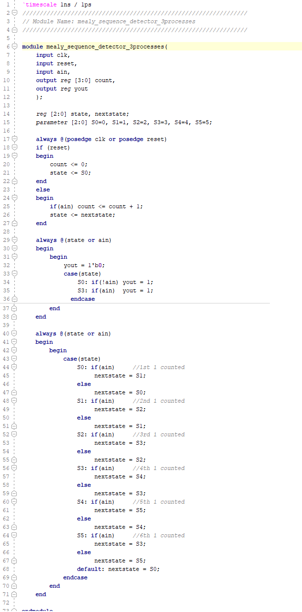
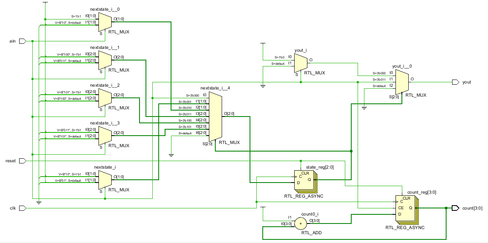
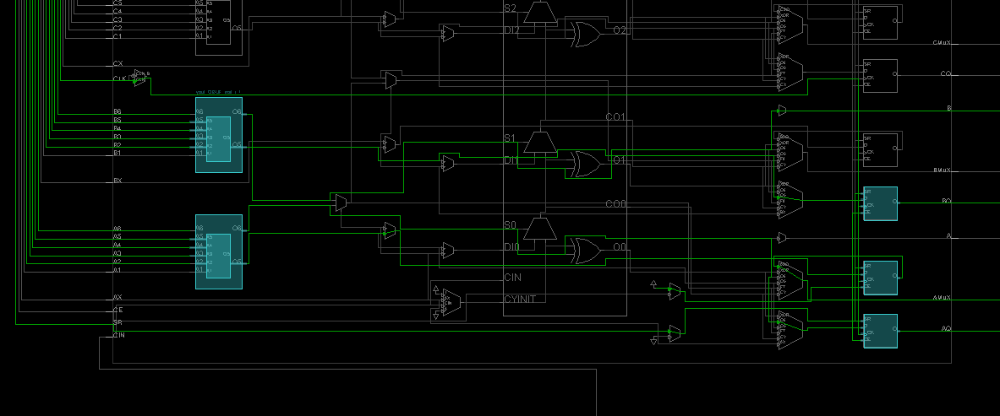
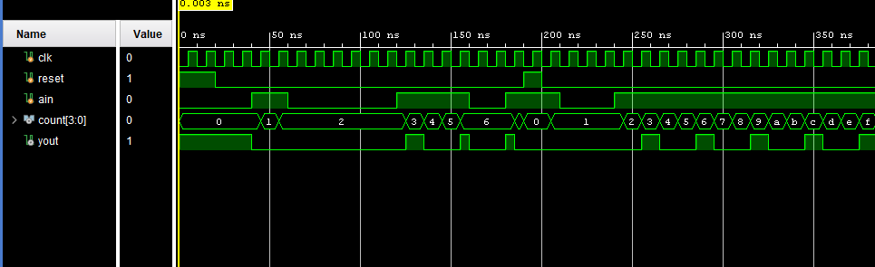
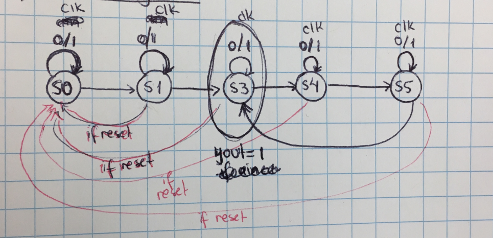
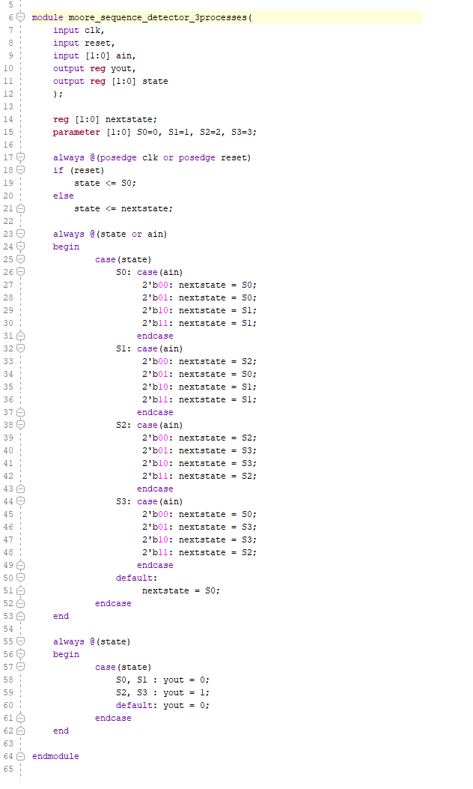
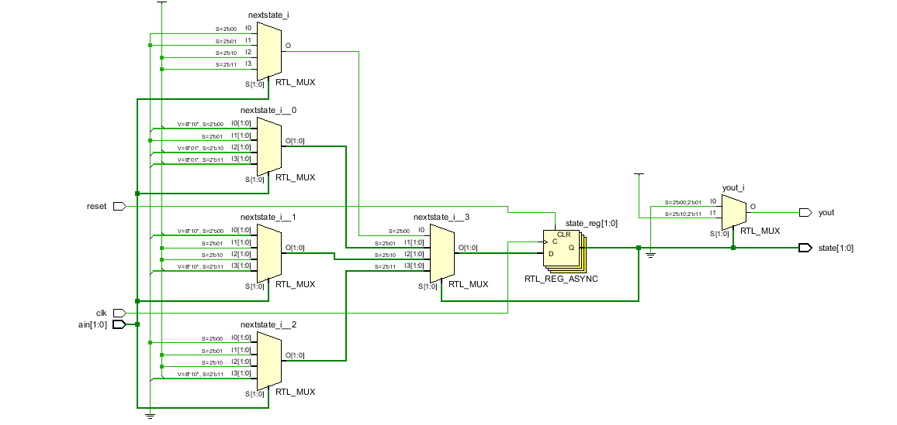
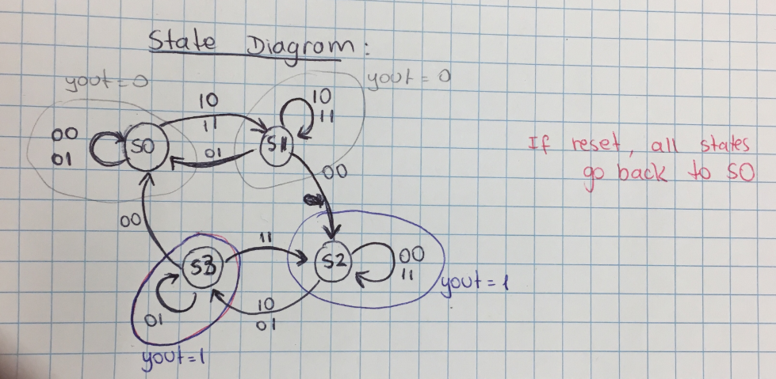

Isabela Porfirio de Aguiar

LAB 10

# Lab 10 - FSM-Moore-Mealy

What are FSM?

Finite State Machines (FSM) are sequential circuit used in many digital systems to control the behavior of
systems and dataflow paths.

Mealy and Moore are two different types of FSMs.

## Lab 10_1_1 Mealy Sequence Detector

In a Mealy machine, the output depends on both the present (current) state and the present (current) inputs.

#### Verilog Code

#### RTL

#### Implementation

#### Testbench

The Mealy state machine has one input (ain) and one output (yout). The output yout is 1 if and only if the total number of 1s received is divisible by 3. Input ain needs to be 1. Can see in the testbench that yout is 1 only when count is a multiple of 3 AND ain is 1.

#### Testing

In the board ain is SW[0] , yout is LED[0] , clock is SW[15], reset is M18 and count[3:0] are LEDs 4, 5, 6 and 7.

Each clock pulse adds one to the four bit output count[3:0]. When count is a multiple of 3 at the same time as ain is 1, then yout is 1. 

The output depends on the current state and on the current inputs. 

#### State diagram 

## Lab 10_1_2 Moore 

#### Verilog Code

#### RTL

#### State Diagram

#### Testing

In a Mealy machine, the output depends only on the present (current) state.

Reset takes it back to State 0.

Need the clock pulse to change state.

When in State 0 and State 1, yout = 0.

When in State 2 and State 3, yout = 1.