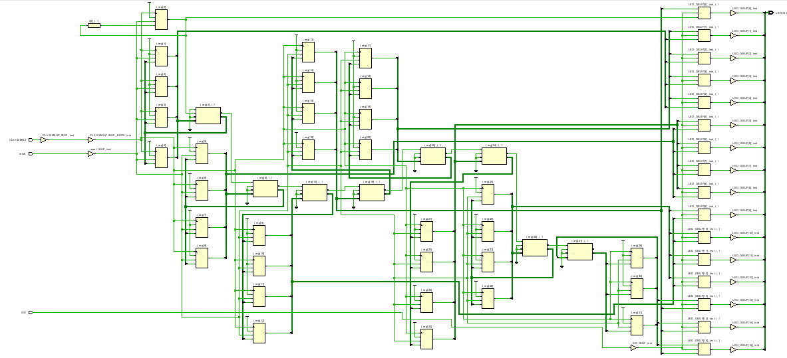
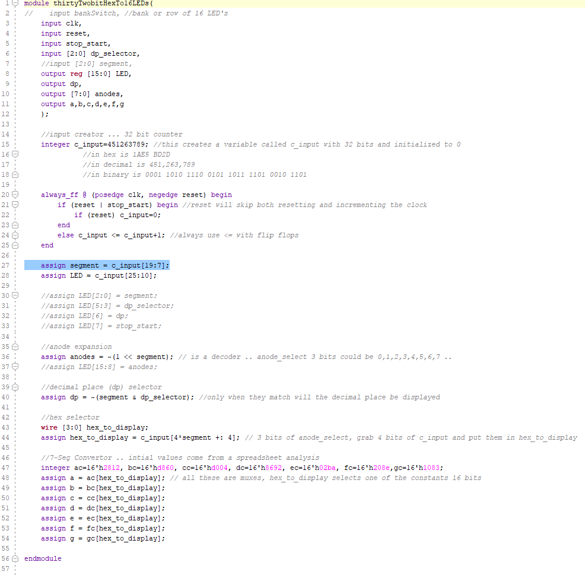
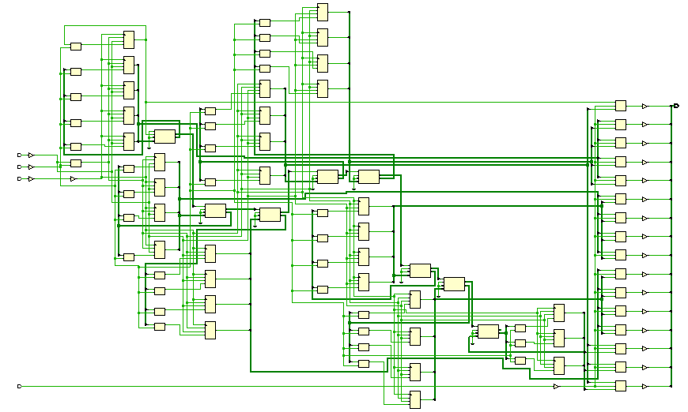

# Reusable BCD hex 7seg Display Code

The  HexToBCD algorithm in the last lab worked for one hex group. The problem is that it needs to be extended from 4 bits to 32 bits. Decoders, clocks and counters need to be added. The goal is to get that done here.

## Figure out what a decoder does. Explain in the testing.

## 2Decoder

#### Port Diagram

#### Verilog Code

#### RTL Schematic Screen shot

#### Synthesis Schematic Screen shot

#### Implementation Device screen shot zoomed in on something interesting

#### Testing

The decoder is turning 3 inputs into 16 outputs, in this case. Exactly two LEDs will be on all times (one y and one z), no more than 2 at once. 

 

___

## 1_32bitHexTo16LEDs

This code tests the ability to count clock pulses and display 32 bits split into two groups of 16. SW[0] switches between the two groups. 

#### Port Diagram

#### Verilog Code

#### 

#### RTL Schematic Screen shot

#### 

#### Synthesis Schematic Screen shot

#### Implementation Device screen shot zoomed in on something interesting

First Flip Flops Being Used, 

Carry Logic Being used

#### Testing

SW[0] switches between first and last 16 digits. When sw[0] is in position 1,it shows the first 16 digits. The digits are moving too quick, so cannot see the lights changing (they're on all the time). When SW[0] is in position 1, it shows the last (most left) 16 digits. Can see the left side lights changing. Can see the counting. SW[1] resets.

___

## 3_bitSlicing

The goal  is to find a way to grab 4 bits out a group of 32 in a single line of code.  This technique is called bit slicing.  This is similar to slicing up a string or an array in other languages. 

#### Port Diagram

#### Verilog Code 

#### RTL Schematic Screen shot

#### Synthesis Schematic Screen shot

#### Implementation Device screen shot zoomed in on something interesting

Four Luts are used to handle the multiplying asked for in the bit slicing.

#### Testing

3 Select bits select 1 of 8, 4 bit groups from a 32 bit constant and display on LEDs.  

------

#### Prompts

Slicing is part of a number of languages including  [python](https://www.programiz.com/python-programming/methods/built-in/slice) , [matlab](https://stackoverflow.com/questions/11318724/matlabs-slice-function-not-working-as-desired) and is a common search term to find something in other languages [C](https://stackoverflow.com/questions/14618342/copying-a-subset-of-an-array-into-another-array-array-slicing-in-c), [regular expressions](https://stackoverflow.com/questions/35578470/how-to-slice-characters-from-string-using-regex). *Is slice a concept or syntax in verilog*?

## 4_32bitsHexTo7segAnd16LEDs

This project is not yet finished. Please finish the documentation of it. It has  the switch between the two banks of 16 LEDs. Don't bother adding this to the port diagram. 

#### Port Diagram

#### Verilog Code

#### RTL Schematic Screen shot 

#### Synthesis Schematic Screen shot

#### Implementation Device screen shot zoomed in on something interesting

#### Testing

