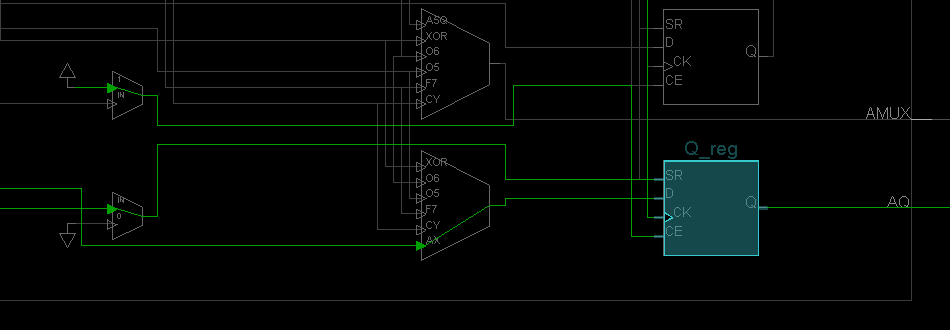
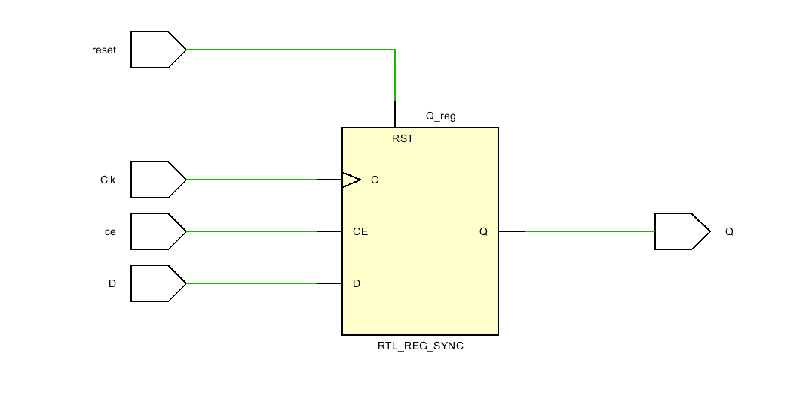
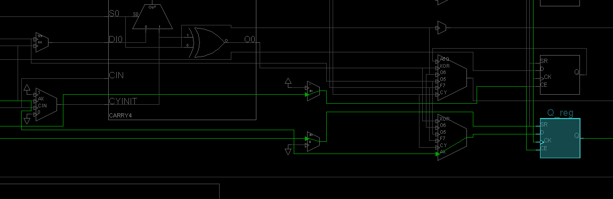

Isabela Porfirio de Aguiar

LAB 5

## 5 Latches and Flip Flops

Create these labs. Just do an RTL-schematic screen shot and something interesting device screen shot. Test them.  Copy all the bit files to a single folder so they can be demonstrated quickly all at once. 

The text associated with them is a pdf called Lab5. Figure out what points the text is making and create prompts in your lab notebook for yourself.

Lab5_1_1 is working. 
Labs 5_1_2 and 5_1_3 have a  file called "lab5_prehook". But the single line in this file in the xdc file. 

The major take away from this lab is using the tb_bench and understanding what a synchronous reset is. In the future we are going to be letting Vivado choose when to use a flip flop, not directly using them. 

## **Lab 5_1_1** - SR Latch

### Verilog Code

### RTL-schematic

### Synthesis

### Implementation

## Lab 5_1_2 - SR Gated Latch

### Verilog Code

### RTL-schematic

### Synthesis

### Implementation

### Testing

When enable input is 0, output does not change. It keeps previous output even if inputs R and S change. 

When enable is 1, inputs R or S will determine the outputs. If have 01 for SR, then have 01 for outputs. But if change SR back to 00, the output is still 01 until change input again. 

## Lab 5_1_3 - D Latch

### Verilog Code

### RTL-schematic

### Synthesis

### Implementation

### Testing

Now there are only two inputs: Enable and D. If Enable is 0, then the outputs Q and Qbar will not change. Keeps last output. Only Q or Qbar is 1. Never both on nor both off.

When Enable is 1, then output will depend on D. If D=0, then Q=0 and Qbar=1. If D=1, then Q=1 and Qbar=0.

## Lab 5_2_1 - D FlipFlop Behavior

### Verilog Code

### RTL-schematic

### Synthesis

### Implementation

### Testing

Inputs are D and Clk. Every time the clk pulses (turns from 0 to 1), it outputs the input D to Q. 

If D is 1 when Clk pulses, then Q become 1

If D is 0 when Clk puses, then Q become 0.

## Lab 5_2_2 - Circuit

### Verilog Code

### RTL-schematic

### Synthesis

### Implementation

### Testing

The word **posedge** in the Verilog code means the POSITIVE pulse of the clock (Clk switches from 0 to 1)

The word **negedge** in the Verilog code means the NEGATIVE pulse od the clock (Clk switches from 1 to 0)

Inputs are D and Clock

Outputs are Qa, Qb and Qc

**OUTPUTS:**

Qa=1 when: D=1 AND Clock=1

Qa=0 when: D=0 (No matter what Clk is)

Qb=1 when: D=1 and Clock switches from 0 to 1 (Positive pulse)

Qb=0 when: D=0 and Clock switches from 0 to 1 (Positive pulse)

Qc=1 when: D=1 and Clock switches from 1 to 0 (Negative pulse)

Qc=0 when: D=0 and Clock switches from 1 to 0 (Negative pulse)

## Lab 5_2_3 - D FlipFlop sync reset behavior

### Verilog Code

### RTL-schematic

### Synthesis

### Implementation

### Testing

Reset is triggered by the clock. If reset is 1, but there is no clock pulse, nothing happens. 

Reset also trigs D. Input D is displayed as the output only when there is a positive pulse of the clock (when clock switches from 0 to 1).

## Lab 5_2_4 - D FlipFlop with CE and sync reset behavior

### Verilog Code

### RTL-schematic

### Synthesis

Vivado creates this FDRE module. Looked it up on Xilinx  Libraries Guide for Schematic Designs. Flip Flop Table:

Design Element: FDRE. Description: Primitive: D Flip-Flop with Clock Enable and Synchronous Reset. 

### Implementation

### Testing

Looks like output 1 is only displayed if both D and ce are 1 (and reset is 0). Reset is independent of CE, it works no matter what, when clk pulses from 0 to 1, no matter what CE and D are, it resets output to 0. 

## Lab 5_2_5 - T FlipFlop enable behavior

### Verilog Code

### RTL-schematic

### Synthesis

###  Implementation

### Testing

The T ("toggle") FlipFlop changes its output on each negative clock edge. Because the Verilog code uses "!reset", it resets when reset is 0 instead of 1. 

