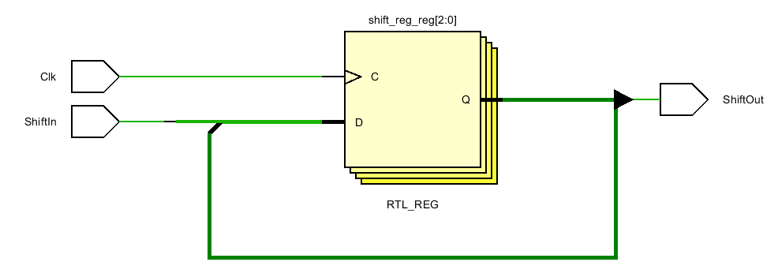
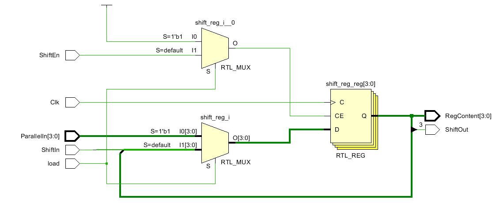

Isabela Porfirio de Aguiar

# Lab 6

## 1-1 4 bit register with synchronous reset

D flip flops differ in the bottom label. This one says RTL_REG_SYNC.

*Why is the load line connected to CE and the reset line connected to RST? Just because of the order in the if command?* Yes

#### Testing

Load enables the clock. Need load=1 for Clk to work. If load=0, clock doesn't do anything. 

Reset=1 resets all outputs to 0, but only trigged by positive edge of clock. Reset does not do anything without clock. 

## 1-2 Register with synch set reset load behavior 

*So there are three ways to control the register, RST, SET and load. And they have to be in the nest order of those if commands. This is strange .. but it makes it easier to remember. First Reset, then Set, then Load. What does Load do? What is CE?*

#### Testing

Load enables the clock. D's only work if load=1. If load=0, clock doesn't do anything with D's. Set and reset DO NOT depend on load. Set=1 sets all outputs=1, no matter what load and D's are, as long as Clock is 1. Reset=1, resets all outputs=0, no matter what load and D's are, as long as clock is 1. Set and Reset only work with clock positive edge (when clock switches from 0 to 1). 

I tried Set=1 AND reset=1 and it reset all outputs = 0. So reset is "stronger" than set.

## 1-3 One Bit Delay

*The { } command above is where the shift occurs. Why not use >> or << ? Does it still work?* It normally shifts in 0's. To shift in ones, have to not, then shift, then not back. Also << shifts in more than one bit which would either be multiple 0's or multiple 1's, not a mixture. It's use is limited.

Why is this named RTL_REG rather than RTL_REG_SYNC like the ones above?

#### Testing

The coding is actually a Three Bit delay. It takes 3 clock pulses for input to be output. 

When changing the input, it takes 3 pulses for that change to make it to the output.

## 1-4 ShiftLeft

Again, we see RTL_REG.  *What is the difference between RTL_REG and RTL_REG_SYNC? Are we going to see a RTL_ASYNC?*

#### Testing

The load blocks ShiftIn and ShiftEn. Load anables the clock to display ParallelIn[3:0]. If load is 0, allows ShiftIn and ShiftEn, which shift output to the left.

## 1-5 Serial in parallel out enable behavior

#### Testing

ShiftEn blocks the Clock if=0. If ShiftEn=1, t enables the Clk to shift the input from ShiftIn left, 1 time for each clk tick, until it reaches ShiftOut output. ShiftOut displays the output from ParallelOut[3]. When shifted left from ShiftOut, that output is gone. 

Clk does not do anything if ShiftEn is 0.

### 2-1 Eight bit counter with T flop behavior

### RTL Schematic

### Implementation

#### Testing

This is a counting code. It counts from 0 to 255. It adds one bit at each negative pulse clock, if enable =1. 

If enable = 0, it blocks the clock and nothing is added. 

For this to happen, Clear_n needs to be =1. If clear_n=0 when the clock pulses negative, it clears all outputs, no matter what enable is.  

### 2-2 Eight bit counter with D flop behavior

### RTL Schematic

### Implementation

#### Testing

The behavior is the same as 6_2_1, except the trigger now is the positive edge of the clock.

It still counts from 0 to 255, adding one bit for each positive pulse of clock, when enable and clear_n are both =1.

If enable = 0, it blocks the clock and nothing is added. 

If clear_n=0 when the clock pulses positive, it clears all outputs, no matter what enable is.  

### 2-3 Four bit down counter with load enable behavior

### RTL Schematic

### Implementation

#### Testing

Counts down from 10 to 0. Subtracts 1 at each positive edge of the clock, as long as Enable is 1. If Enable is 0, nothing gets subtracted. 

Load sets counter back to 10 (1010), when clock pulses, as long as Enable is 1. Enable blocks Load if it is 0. 

Clear sets all counting equal to 0 (all outputs are 0), on the positive pulse of clock. Enable DOES NOT block Clear. 

If Load and Clear are set at the same time, Clear wins. 

