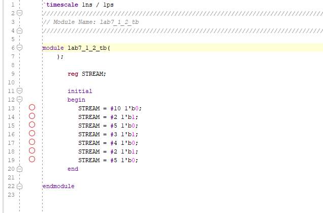

Isabela Porfirio de Aguiar

# Lab 7

## LAB 7-1-1 Testbench1 DELAY

The initial statement is mainly used in testbenches to generate inputs at a desired time, whereas the always statement is mainly used to describe the functionality of the circuit. 

Both the initial and always statements may have simple or block of (having enclosed between begin … end)  procedural statement(s).

#### Testing

The test bench does not describe a circuit. The Delay determined the unit of time in which the changes on PortA happens. 

## LAB 7-1-2 Testbench2 STREAM

#### Testing

The test bench does not describe a circuit. The Delay determined the unit of time in which the changes on PortA happens. 

## LAB 7-1-3 

#### 

#### Testbench code

Testbench interacts with verilog code

#### Testbench

#### RTL Schematic

#### Synthesis

#### Implementation

#### Testing

When sel[0]=0 AND sel[1]=0, Then Q = channel[0]

When sel[0]=0 AND sel[1]=1, Then Q = channel[1]

When sel[0]=1 AND sel[1]=0, Then Q = channel[2]

When sel[0]=1 AND sel[1]=1, Then Q = channel[3]

## LAB 7_1_4 - Gray code case

#### Verilog Code

#### RTL Schematic

#### Implementation

#### Testing

Gray code changes only one bit at the time. Code gets input in bcd and outputs in Gray code. It is only coded for number from 0 to 9. If input is anything else, is will get an invalid result and output 1111 (the default). Also enable needs to be 1. Otherwise outputs invalid too.

## LAB 7_1_5 - Specific counter case

#### Verilog Code

#### RTL Schematic

VIVADO keeps using ROM everytime there's a "case" on the code. Why ? in reality, there is no ROM.

#### Testbench code

#### Implementation

#### Testing

Code counts in the following sequency:

000

001

011

101

111

010  and back to the beggining. Goes on and on on a circle.

Numbers change on the positive edge of the clock. Eneble needs to be =1 for them to change. 

If reset = 1, the counter is set back to the beggining (000) at the positive edge of the clock, no matter what enable is. 

#### 

