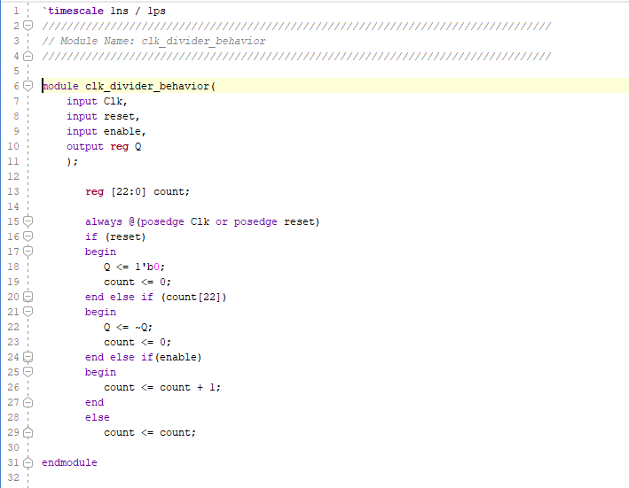
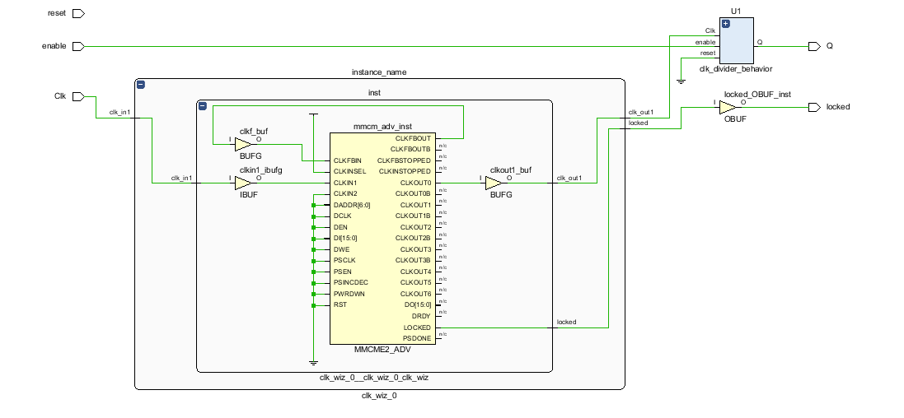
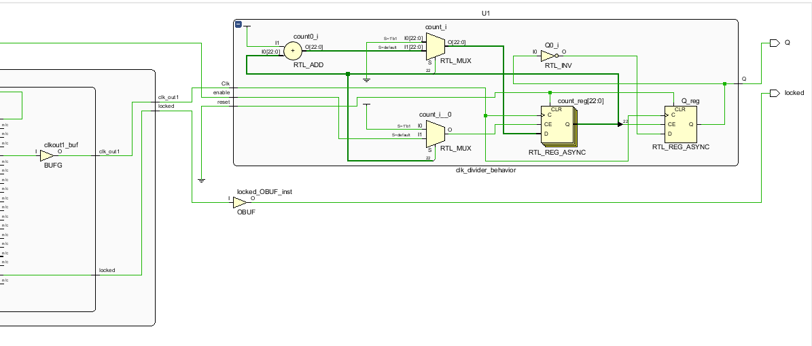
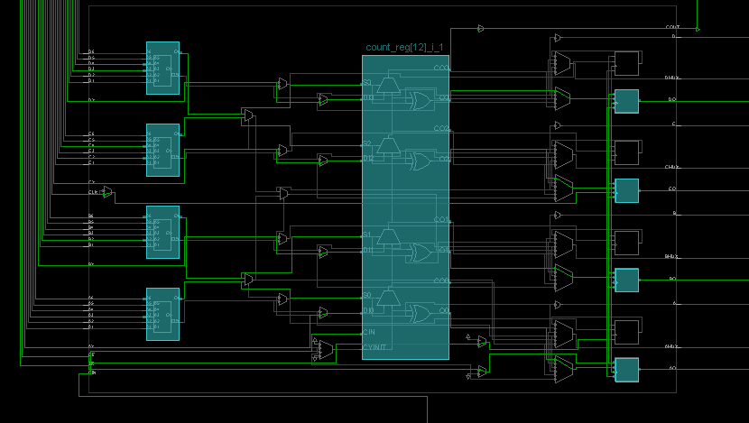

Isabela Porfirio de Aguiar

# Lab 8

## LAB 8

#### Verilog Code

#### RTL Schematic

#### Implementation

#### Testing

Need to choose 5Hz frequency because of the code having reg[22:0]

2^22 is a little more than 4Hz. So 5 is just enough.

2^23 woulg be more than 8Hz. Too much.

