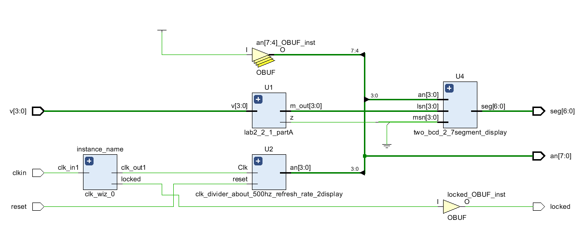

Isabela Porfirio de Aguiar

# Lab 8

## LAB 8_1_1

#### Verilog Code

#### RTL Schematic

#### Implementation

#### Testing

Need to choose 5Hz frequency because of the code having reg[22:0]

2^22 is a little more than 4Hz. So 5 is just enough.

2^23 woulg be more than 8Hz. Too much.

## LAB_8_1_2

### Verilog code:

### RTL Schematic

### Testing

Since the 7-segment displays on the Nexys4 DDR board use common cathodes and a
particular display is illuminated by asserting the corresponding anode pin, a scanning circuit is required to
display information (digits) on more than one display. This circuit should drive the anode signals and
corresponding cathode patterns of each digit in a repeating, continuous succession, at an update rate that
is faster than the human eye can detect. In order for each of the digits to appear bright and continuously
illuminated, all desired digits should be driven once every 1 to 16ms, for a refresh frequency of 1 KHz to
60 Hz. If the update or “refresh” rate is slowed to around 45 Hz, most people will begin to see the display
flicker.

Need to set clk_wiz_0 as 5MHz. 

Need to set the "binary2bcd_on_2_7_segment_Nexys4ddr" as top in hierarchy

Circuit display the sum of binary 4-bit input as 7-segment diaplay (2 digits).

