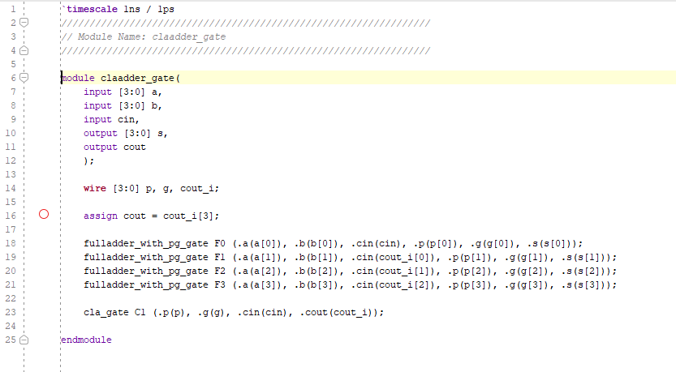

Isabela Porfirio de Aguiar

LAB 9

# Lab 9 - Stop Watch

## Lab 9_1_1

#### Verilog Code

#### RTL

p and g are look-ahead adders that improve the speed by reducing the amount of time required to determine carry bits.

#### Testbench

#### 

Testbench creates a cout_expected and s_expected. Can see the difference between the expected values and actul values in the testbench, which are caused by the delays.

On Vivado, I could click on the edges and observe that the difference in time between the 

## Lab 9_1_2

#### Verilog Code

Can see modification in the code, from the previous one.

In part 1 (9_1_1). the parameters were defined in the main verilog code. Can see the  #(3, 3, 4) in the code. And passed to the modules. 

For this part (9_1_2), the parameters were not defined in the main verilog code. Instead, the "defparam"

 tool was used in the testbench.

#### RTL

RTL did not change

#### Testbench

Defparam statements were added to the testbench , changing the values of the delays.

